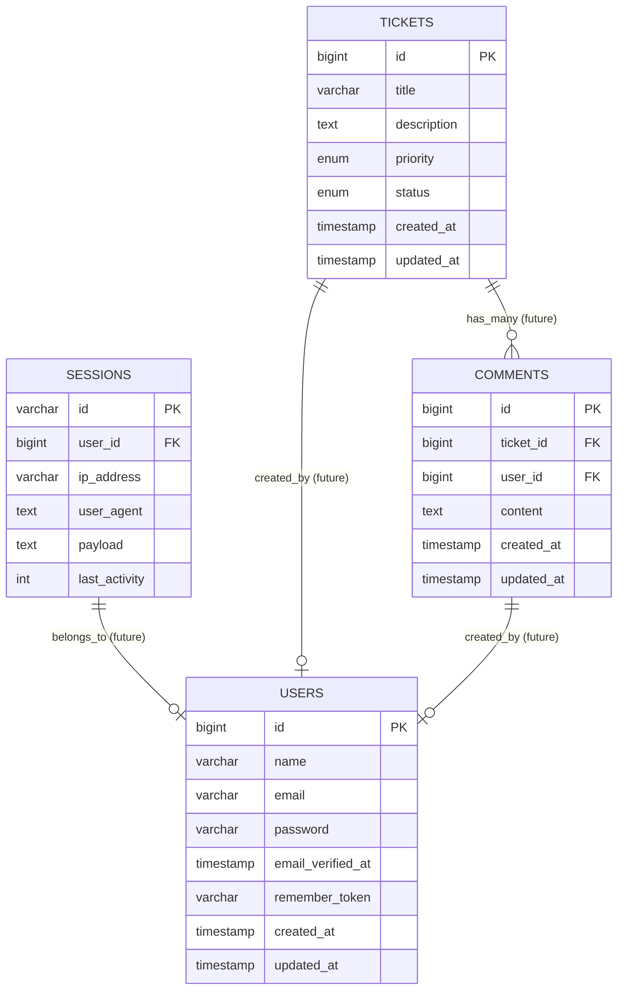

# Entity Relationship Diagram (ERD) for Laravel Ticket System

## Current Schema Explanation

### Tickets Table
- **id**: Primary key, auto-incrementing integer
- **title**: String containing brief ticket description
- **description**: Longer text with detailed issue description
- **priority**: Enum with values ['Low', 'Medium', 'High']
- **status**: Enum with values ['Open', 'In Progress', 'Closed']
- **created_at**: Timestamp when ticket was created
- **updated_at**: Timestamp when ticket was last updated

### Sessions Table
- **id**: Primary key, string identifier for the session
- **user_id**: Foreign key to users table (once implemented)
- **ip_address**: IP address of the client
- **user_agent**: Browser/client information
- **payload**: Serialized session data
- **last_activity**: Timestamp of last activity

## Planned Future Schema

### Users Table
- **id**: Primary key, auto-incrementing integer
- **name**: User's full name
- **email**: User's email address (unique)
- **password**: Encrypted user password
- **email_verified_at**: Timestamp when email was verified
- **remember_token**: Token for "remember me" functionality
- **created_at**: Timestamp when user was created
- **updated_at**: Timestamp when user was last updated

### Comments Table
- **id**: Primary key, auto-incrementing integer
- **ticket_id**: Foreign key to tickets table
- **user_id**: Foreign key to users table
- **content**: Text content of the comment
- **created_at**: Timestamp when comment was created
- **updated_at**: Timestamp when comment was last updated

## Relationships

- A ticket will be associated with a user (creator) in the future
- A ticket can have many comments
- Each comment belongs to a specific ticket and user
- Sessions are associated with users for authentication