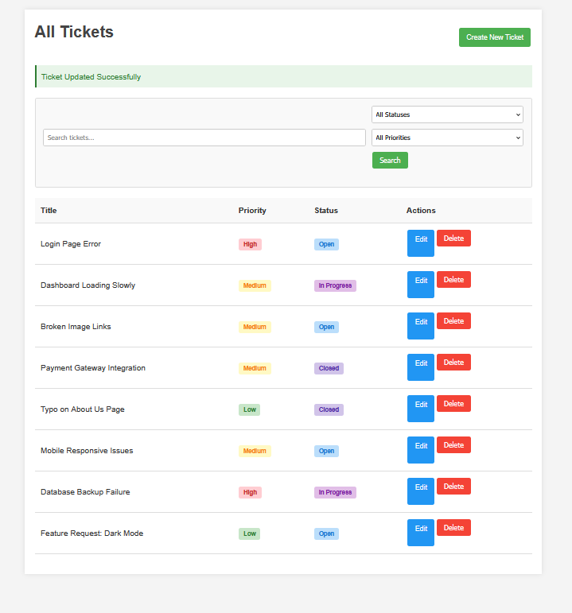
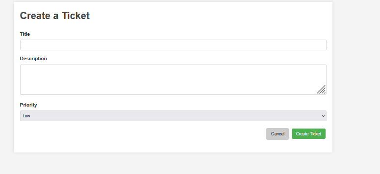
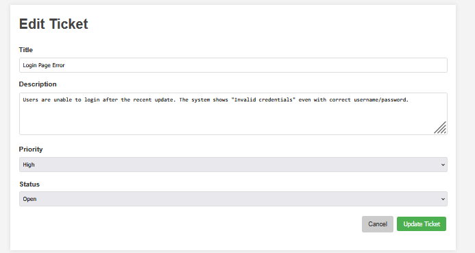

# Laravel Ticket System

A streamlined ticket management system built with Laravel, providing essential CRUD functionality for support tickets, issue tracking, and basic workflow management.

## Overview

This application allows users to create, view, update, and delete support tickets. Each ticket includes a title, description, priority level, and status tracking. The system provides an intuitive user interface for ticket management operations.

## 📋 Features

- **Full CRUD Operations**: Create, read, update, and delete tickets
- **Priority Levels**: Categorize tickets as Low, Medium, or High priority
- **Status Tracking**: Track tickets through their lifecycle (Open, In Progress, Closed)
- **Responsive Design**: Basic but functional UI that works across devices

## 🖼️ Screenshots

- View All Tickets 
- Create New Ticket
- Edit Ticket

<div align="center">
  
  <p><em>Homepage with ticket listing, search and filters</em></p>
  
  
  <p><em>Create new ticket form</em></p>
  
  
  <p><em>Edit existing ticket with status options</em></p>
</div>

## 🛠️ Technology Stack

- **[Laravel 12.x](https://laravel.com/docs/12.x)**: PHP framework
- **[MySQL](https://www.mysql.com/)**: Database
- **[Blade Templating](https://laravel.com/docs/12.x/blade)**: For views
- **PHP 8.4+**: Backend language

## 📊 Architecture Diagrams

- Class Diagram
- User Flow
- Database Schema
- Request-Response Cycle

## 📋 Prerequisites

- PHP 8.4 or higher
- Composer
- MySQL
- PHP Extensions: PDO, Fileinfo, MySQL

## 🔧 Installation

1. **Clone the repository**
   ```bash
   git clone https://github.com/yourusername/ticket-system.git
   cd ticket-system
   ```

2. **Install dependencies**
   ```bash
   composer install
   ```

3. **Configure environment**
   ```bash
   cp .env.example .env
   php artisan key:generate
   ```

4. **Update database configuration in .env**
   ```
   DB_CONNECTION=mysql
   DB_HOST=127.0.0.1
   DB_PORT=3306
   DB_DATABASE=ticketsystem
   DB_USERNAME=root
   DB_PASSWORD=your_password
   ```

5. **Run migrations**
   ```bash
   php artisan migrate
   ```

6. **Start the development server**
   ```bash
   php artisan serve
   ```

7. **Access the application**
   - Visit [http://127.0.0.1:8000](http://127.0.0.1:8000) in your browser

## 📝 Usage

### Creating a Ticket
1. Click "Create New Ticket" on the homepage
2. Fill in the required fields (Title, Description, Priority)
3. Submit the form

### Editing a Ticket
1. Find the ticket in the list
2. Click the "Edit" button
3. Modify fields as needed
4. Submit the changes

### Deleting a Ticket
1. Find the ticket in the list
2. Click the "Delete" button
3. Confirm deletion

## 📁 Project Structure

```
TicketSystem/
├── app/
│   ├── Http/Controllers/      # Controllers
│   │   └── TicketController.php
│   └── Models/               # Eloquent Models
│       └── Ticket.php
├── database/
│   └── migrations/           # Database migrations
├── resources/
│   └── views/
│       └── tickets/          # Blade templates
│           ├── index.blade.php
│           ├── create.blade.php
│           └── edit.blade.php
├── routes/
│   └── web.php              # Route definitions
├── Documentation.md         # Detailed documentation
└── *_diagram.mermaid        # Architecture diagrams
```

## 📚 Additional Documentation

For comprehensive details about the project structure, database schema, controller methods, and more, please refer to our Documentation.

## 🔄 API Routes

| Method | URL | Action | Description |
|--------|-----|--------|-------------|
| GET    | `/` | index  | List all tickets |
| GET    | `/ticket/create` | create | Show create form |
| POST   | `/ticket/store` | store | Create new ticket |
| GET    | `/ticket/{id}/edit` | edit | Show edit form |
| POST   | `/ticket/{id}/update` | update | Update ticket |
| POST   | `/ticket/{id}/delete` | destroy | Delete ticket |

## 🚀 Future Enhancements

- User authentication and role-based permissions
- Email notifications for ticket updates
- File attachments for tickets
- Comment system for ticket discussions
- Dashboard with ticket statistics
- Ticket assignment to specific users

## ⚙️ Troubleshooting

For common issues and solutions, check out the Troubleshooting section in our documentation.

## 📄 License

This project is open-sourced under the MIT license.